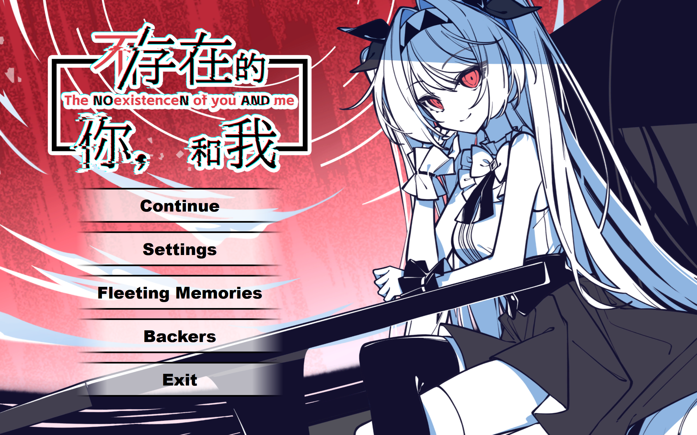

# The NOexistenceN of you AND me Web Based

A "non functional" fan tribute to the game **The NOexistenceN of you AND me**, originally developed by **Nino Games** and **0x0Real Studio**.

<div align="center">
  
</div>

## Features

- **Immersive Interface**: Custom main menu with hover animations and seamless transitions.
- **Audio Integration**: Background music (OST) support with interactive playback controls.
- **Visuals**: Animated backgrounds and planned 3D interactive book model integration.
- **Modern Tech**: Built with React 19 and TypeScript for a robust, type-safe architecture.
- **Smooth Animations**: fluid UI interactions powered by Framer Motion.

## Tech Stack

- **Framework**: [React 19](https://react.dev/) + [TypeScript](https://www.typescriptlang.org/)
- **Build Tool**: [Vite](https://vitejs.dev/)
- **Styling**: [Tailwind CSS v4](https://tailwindcss.com/)
- **Animation**: [Framer Motion](https://www.framer.com/motion/)
- **Icons**: [Lucide React](https://lucide.dev/)

## Prerequisites

Before you begin, ensure you have the following installed:

- **Node.js**: v18 or higher (LTS recommended).
- **Package Manager**: npm, yarn, or pnpm.

### Installation & Run

1. Clone the repository.
2. Install dependencies:
   ```bash
   npm install
   ```
3. Start the development server:
   ```bash
   npm run dev
   ```

## Roadmap

- [x] 1st page - Main menu: (should be done)
- [ ] 2nd page - Continue (VN like book-note of Lilth):
- [x] Settings: UI for settings. (67% cause idk how to do the hover animation and also no text yet so can't test text speed)
  - [ ] Hover animation for customizeable/reset/return.
- [ ] Fleeting Memories: Gallery.
- [ ] Backers: Credits.
- [ ] Exit: Exit Screen with and voice lines.

## Disclaimer

This is a non-profit fan project. I do not own the rights to the original game. All credit for the concept, characters, and assets goes to Nino Games and 0x0Real Studio. Please don't sue me; I'm just a fan with a text editor and a dream.

<div align="center">
  
</div>